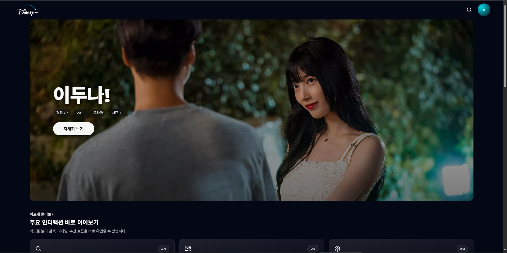
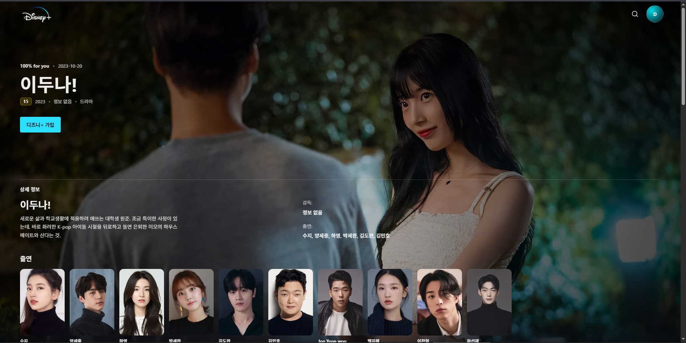
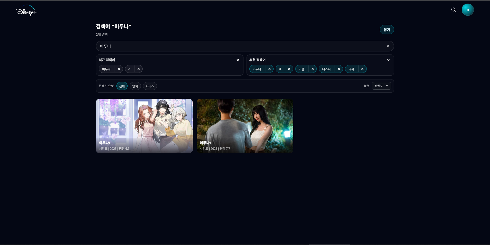

# 🎬 Disney+ Renewal

<p align="center">
  
  
  
  
</p>

<p align="center">
  Disney+ UI/UX를 React 기반으로 재해석한 SPA 프로젝트
  <br />
  <strong>상태 기반 UI · 라우팅 제어 · 배포 구조</strong>까지 고려한 실서비스 시뮬레이션
</p>

---

## 🌐 Live
### 현재 리뉴얼 버전
- **Vercel Production**: 👉 [https://b4ng-disney-plus.vercel.app/](https://b4ng-disney-plus.vercel.app/)

### 과거 초기 버전
- **Firebase Hosting (Legacy)**: [https://react-disney-project-6834d.web.app/](https://react-disney-project-6834d.web.app/)

---

## 🖼 Preview

<p align="center">
  
  
  
</p>

---

## 🎯 Purpose

이 프로젝트는 단순한 UI 클론을 넘어, 실제 서비스 환경에서 발생할 수 있는 문제를 기준으로 설계한 프론트엔드 프로젝트입니다.

API 실패, CDN 오류, 빈 데이터, 이미지 로드 실패 같은 예외 상황까지 고려해 상태 기반 UI를 구성했고, 사용자 흐름이 끊기지 않도록 라우팅과 상태 전환 구조를 함께 설계했습니다.

핵심 목표는 화면 구현에 그치지 않고, 배포와 운영까지 고려한 실서비스형 구조를 만드는 것이었습니다.

---

## ✨ Key Features

- Hero Banner / Top10 / Row 기반 콘텐츠 탐색 구조
- 모바일 / 데스크탑 인터랙션 분기
- Skeleton UI 기반 비동기 상태 처리
- 추천어 / 최근 검색 흐름을 반영한 Search UX
- Trailer 유무에 따른 Detail UI 분기
- 유사 콘텐츠 및 fallback 콘텐츠 처리
- ProtectedRoute / PublicOnlyRoute 기반 접근 제어
- `loading / error / empty` 상태 UI 분리
- `no-image / image-error / cdn-fail` fallback 처리
- 사용자 권한 기반 피드백 CRUD 시스템

---

## 🧠 Tech Stack

<p align="center">
  
</p>

<p align="center">
  React Router · Styled Components · TanStack Query · Swiper · Playwright
</p>

---

## 🏗 Architecture & Flow

이 프로젝트는 클라이언트, 서버, 배포 환경을 분리해 구성했습니다.

- React SPA 기반 상태 중심 UI 구조
- Express Proxy 서버를 통한 TMDB API Key 보호
- Firebase Auth 및 Firestore를 통한 인증 / 데이터 관리
- Vercel 배포 환경에서 `main` 브랜치를 기준으로 프로덕션 운영

브랜치 전략은 다음과 같이 운영합니다.

- `main`: 실제 서비스가 배포되는 프로덕션 브랜치
- `dev`: 기능 통합 및 다음 버전 개발 브랜치
- `release/*`: 릴리즈 전 검증 및 QA 브랜치
- `hotfix/*`: 배포 이후 긴급 수정 브랜치

---

## ⚙️ Environment

로컬 환경 변수는 `.env.local` 파일을 기준으로 설정합니다.

```bash
REACT_APP_FIREBASE_API_KEY=
REACT_APP_FIREBASE_AUTH_DOMAIN=
REACT_APP_FIREBASE_PROJECT_ID=
REACT_APP_FIREBASE_STORAGE_BUCKET=
REACT_APP_FIREBASE_MESSAGING_SENDER_ID=
REACT_APP_FIREBASE_APP_ID=
TMDB_API_KEY=
```

자세한 예시는 [.env.example](./.env.example) 파일을 참고하면 됩니다.

---

## 🚀 Run

클라이언트 실행:

```bash
npm run client
```

TMDB 프록시 서버 실행:

```bash
npm --prefix server run dev
```

빌드:

```bash
npm run build
```

---

## 📦 Release

현재 기준선은 `v1.0.0`이며, 프로덕션 메인 브랜치 기준으로 안정화된 첫 번째 릴리즈입니다.

- [v1.0.0 Release Notes](./docs/release/2026-04-02-v1.0.0.md)

---

## 🧪 Testing & Debug

프로젝트 전반에 걸쳐 상태 기반 UI 테스트를 수행할 수 있도록 구성했습니다.

- Jest 기반 컴포넌트 테스트
- Playwright 기반 E2E 테스트
- 스크롤 복원 및 상태 UI 테스트
- 디버그 URL 기반 예외 상황 재현

피드백 페이지 전용 테스트 스크립트:

```bash
npm run test:feedback
npm run test:feedback:responsive
npm run test:feedback:visual
npm run test:feedback:visual:update
```

디버그 URL 매트릭스:

- [docs/work/test-notes/debug-url-matrix.md](./docs/work/test-notes/debug-url-matrix.md)

---

## 💻 Local Development

설치:

```bash
npm install
npm --prefix server install
```

기본 테스트:

```bash
npm test
```

---

## 📝 Documentation

릴리즈 문서:

- [2026-04-02 v1.0.0](./docs/release/2026-04-02-v1.0.0.md)
- [2026-03-17 v0.3.0](./docs/release/2026-03-17-v0.3.0.md)

작업 로그:

- [2026-04-02 work](./docs/work/2026-04-02-work.md)
- [2026-04-01 work](./docs/work/2026-04-01-work.md)

릴리즈 리뷰 / 로그:

- [2026-04-02 release diff review](./docs/logs/2026-04-02-release-0.3.0-diff-review.md)

---

## 🧠 Summary

이 프로젝트는 단순한 UI 구현을 넘어, 실제 서비스 운영을 고려한 상태 처리, 라우팅 설계, 배포 구조까지 포함한 프론트엔드 아키텍처 경험을 목표로 진행되었습니다.
